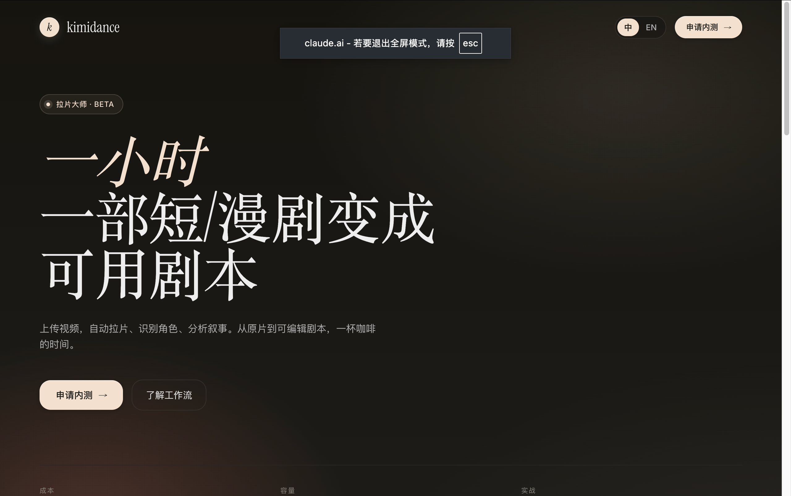

# KimiDance（积米律动）

> AI 自动拉片工具。输入一部短剧/漫剧视频，全自动输出文学剧本 + 叙事节奏分析 + 分镜速查表。



## 它能做什么

| 输入 | 输出 |
|------|------|
| 一部视频（mp4/mov/mkv） | **文学剧本** — 投稿模板格式，台词零篡改 |
| | **叙事节奏分析** — 钩子/冲突/高潮/情绪曲线 |
| | **分镜速查表** — 每个镜头一行（景别/运镜/角色/台词/情绪/叙事功能） |

## 怎么用

```bash
# Web UI（推荐）
./start_web_ui.sh

# 命令行
lapian process 你的视频.mp4
```

三步走：填 API Key → 上传视频 → 等 58 分钟（40 分钟视频）→ 下载三件套。

## 核心红线：台词零篡改

LLM 只做标注和生成，绝不改写原始台词。由 `validate.py` 和 `script_dialogue_validator.py` 两道校验强制执行。ASR 出来的台词是什么，剧本里的台词就是什么。

## 技术栈

**Pipeline**：Python 3.12 + Whisper ASR + PySceneDetect + Gemini 2.5 Flash + GPT-4o

**Web UI**：Streamlit（已上线）/ React + TypeScript（开发中）

**部署**：本地 Mac 安装包，无需云端

## 示例输出

[→ 崇祯元年·拉片样本](samples/崇祯元年_拉片样本.md)

[→ 叙事节奏分析样本](samples/analysis.md)

[→ 分镜速查表样本](samples/breakdown_sample.csv)

## 架构

[→ 完整架构文档](ARCHITECTURE.md)

## 当前状态

- ✅ 核心流水线：Layer 0-2 全流程稳定运行
- ✅ Streamlit Web UI 可用
- ✅ 35 个测试用例
- 🔄 React 前端开发中
- 🔄 Mac 本地安装包工程化

## 联系方式

- 项目链接：[kimi-dance-intro](https://github.com/Olivver798/kimi-dance-intro)
- 微信：见表单
- ClawCon Macao @ BEYOND Expo 2026 — 5/30 线下 Demo
